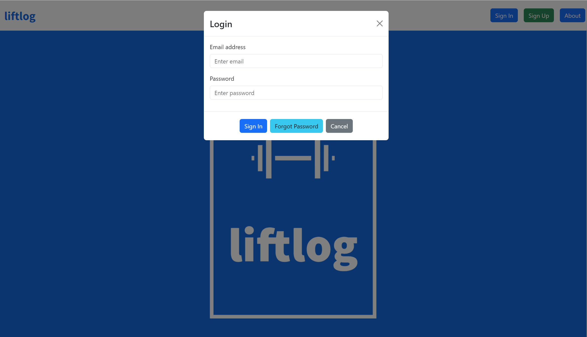
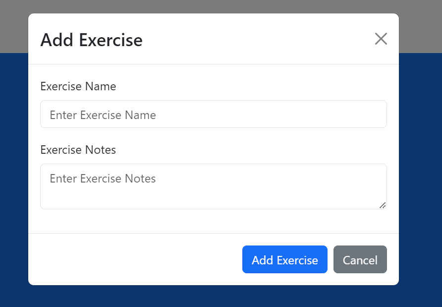
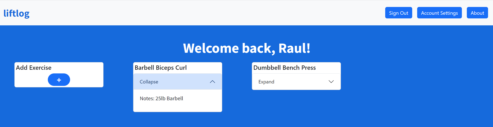
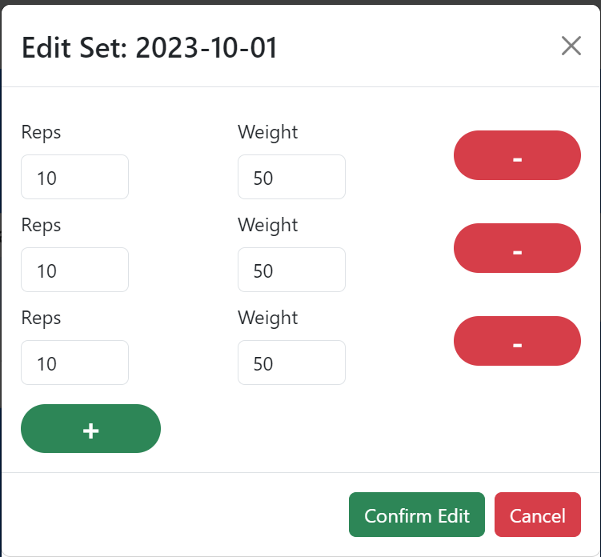
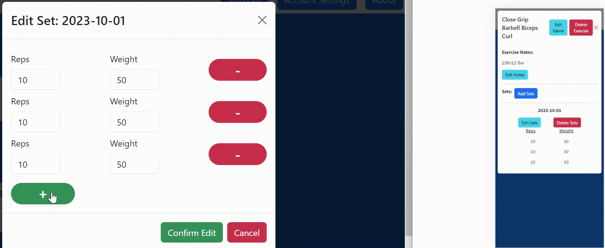
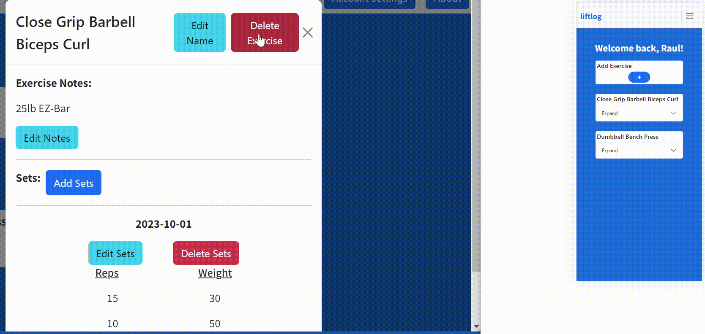

# liftlog

<a href="https://lift-log-react.vercel.app" target="_blank">Live Site</a>

## Project Description

I recently started a weight lifting routine and would struggle to remember exactly how much weight I lifted and how many reps I did for every exercise. I know there are apps out there that can help with this but I didn't want one with a lot of ads or other distractions so I would manually keep track of my progress on a note taking app on my phone. This was ok for a few weeks but then it got too big to quickly look things up. I've also been learning web development and then came up with the idea to create my own web app where I can easily keep track of my progress. For anyone who decides to use this app, please keep in mind it is not a commercial app, there are no ads, and should only be used for educational purposes only. Please do not upload any personal or private information.

### Front-end
- React
- Bootstrap

### Back-end
<a href="https://firebase.google.com" target="_blank">Firebase</a>

#### Why Firebase?
I was already somewhat familiar with it since I used it in another project for a class I took and setting up authentication is not that difficult. It also has a pretty good free tier with no credit card required for signing up.

#### App Instructions
The app is responsive and is meant to work on desktops and well as on tablets or phones.

Upon logging in, a user can add an exercise.

Once a user adds exercises, they will show up on their home page. They can expand the cards to quickly see any notes about the exercise they wrote down. They can then click on the notes or title of the card to open it.

Once open, a user can edit the exercise name and notes. They can also add sets. For convenience, a user can enter rep and weight amounts in the Update All boxes and all rep lines will update to those amounts. A user can then edit or remove any individual lines if they would like to. Due to the fact that Firebase charges by the number of documents read or written to the Firestore Database and not by the size of the data, all daily sets for a particular exercise are uploaded as one document instead of each individual set. The user also had the option to delete an exercise. If they choose to do this, all information regarding this exercise, including all sets, will be deleted. Alternatively, they can choose to delete an individual daily set of sets as well.

A user can also edit previously entered sets.

A neat feature of the Firestore Database is it gives the option of real time updates. If a user is logged into the app on their desktop and their phone, they do not have to refresh the page to get updated data.

Watch how once the user is done editing the sets for October 1st and confirms the edits, the user's mobile version is also updated automatically.

Watch how the user deletes the exercise on the desktop site and it automatically deletes in the mobile version. You cannot tell by the gif, but I have each version open in different browsers. I have event tested this using my phone.

If a user would like to reset their password or delete their account, they can do so by clicking on the Account Settings button.

If they choose to reset their password, they will be logged out and an email will be sent to the one they used to sign up with instructing how to reset.

If they choose to delete their account, all their information and exerise data will be deleted. This action cannot be reversed and data cannot be recovered. The user is given a warning before deleting their account.

Feel free to reach out if you have any questions or suggestions.

<a href="https://www.linkedin.com/in/raul-j-andrial" target="_blank">LinkedIn</a>